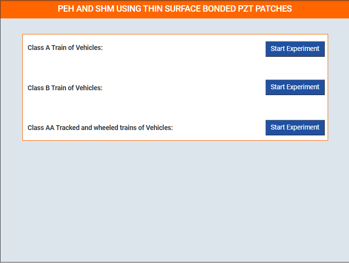

### These steps will be followed for the experiment
<!-- **PRE EXPERIMENT TASK**

1) What is piezoelectricity? 
2) What is piezoelectric energy harvesting? 
3) What is structural health monitoring (SHM)? 
4) What are the possible applications of energy generated by piezoelectric
effect? 
5) What is the order of magnitude of energy harvested by piezoelectric
effect in watts? 
6) How electro-mechanical impedance (EMI) technique can be used for
SHM? 
7) What is root mean square deviation (RMSD)? 
8) What are the salient features of Keysight 4980 LCR meter and AD5933
as far as SHM is concerned? 
9) How much input energy is needed for one time operation of Keysight
4980 LCR meter and AD5933?  -->

**Procedure**

This simulation experiment covers three setups: Class A train of vehicles, Class B train of vehicles and Class AA (tracked and wheeled) train of vehicles (Class 70 R). A bridge is considered on which 4 sets of PZT patches are banded. Each set contains 12 PZT patches. So overall, the bridge contains 48 sensors. The bridge has four spans. Initially in energy harvesting stage/idle state, each set of sensors are connected to the battery through wires. The user can change choose the vehicle class (A or B or AA) to pass over the bridge. As the vehicle moves, the mechanical vibrations in the bridge result in generation of voltage across PZT patch generating electrical power. The generated energy is stored inside a battery. In SHM state, SHM device (AD5933) is attached to the damaged span and the fully charged battery. The energy stored inside the battery is used for evalution of each damaged span.
  

By clicking the appropriate links, the user can download the signatures corresponding to the baseline
(undamaged) and damaged states. To statistically quantify damage, compute root mean square deviation
(RMSD) in conductance by following equation directly in MS excel:
  

  
Where  
 Gi0 = Baseline conductance value at <i>ith</i> frequency. 
 Gi1 = Conductance value after damage at <i>ith</i> frequency. 
<i>n</i> = No. of frequency data points

As an exercise, plot a histogram of RMSD for the various damaged states. Note your observations and draw conclusions.

<!-- **POST EXPERIMENT TASK**

1) Plot the comparison conductance signatures for undamaged and
damaged spans. 
2) Calculate the root mean square deviation (RMSD) values for all the
spans by comparing damaged and undamaged signatures? 
3) Plot the histogram of RMSD for damage condition along the length
(different spans) of bridge. 
4) What is the range of sweep signal? 
5) How much is the energy harvested from vibrations in µW, when the
bridge vibrates for 1 minute. Assume the bridge to be three span
concrete bridge in North of France (Peigney and Siegert, 2013), refer
Table 6.3 (page 139) of <a href="images/naveet.pdf">Ph. D. thesis of Dr. Naveet Kaur</a>. 
 -->
