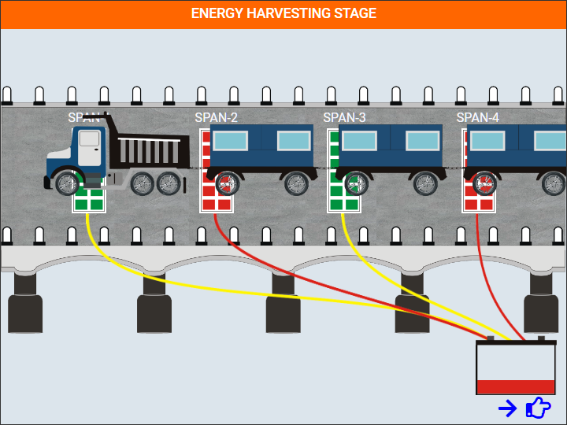

### These steps will be followed for the experiment
<!-- **PRE EXPERIMENT TASK**

1) What is piezoelectricity? 
2) What is piezoelectric energy harvesting? 
3) What is structural health monitoring (SHM)? 
4) What are the possible applications of energy generated by piezoelectric
effect? 
5) What is the order of magnitude of energy harvested by piezoelectric
effect in watts? 
6) How electro-mechanical impedance (EMI) technique can be used for
SHM? 
7) What is root mean square deviation (RMSD)? 
8) What are the salient features of Keysight 4980 LCR meter and AD5933
as far as SHM is concerned? 
9) How much input energy is needed for one time operation of Keysight
4980 LCR meter and AD5933?  -->
 
**Preparation of specimens:**

1. Click start experiment button to start the experiment.

**Class A Train of Vehicles**

2. Click start experiment button to start the experiment.

Click on any button below to take the signature of bridge in corresponding spans for undamaged condition.

Click on Download Data button

Download Data

Click on Induce Damage button to show damage on the bridge.

Show damage on the bridge.

Click on Download Data button

Download Data

Download Data

**Class B Train of Vehicles**

Download Data

Download Data

Download Data

Download Data

Download Data

Download Data

Download Data

Download Data

Download Data

Download Data

Download Data

Download Data

Download Data

Download Data

Download Data

Download Data

Download Data

Download Data

<!-- **POST EXPERIMENT TASK**

1) Plot the comparison conductance signatures for undamaged and
damaged spans. 
2) Calculate the root mean square deviation (RMSD) values for all the
spans by comparing damaged and undamaged signatures? 
3) Plot the histogram of RMSD for damage condition along the length
(different spans) of bridge. 
4) What is the range of sweep signal? 
5) How much is the energy harvested from vibrations in µW, when the
bridge vibrates for 1 minute. Assume the bridge to be three span
concrete bridge in North of France (Peigney and Siegert, 2013), refer
Table 6.3 (page 139) of <a href="images/naveet.pdf">Ph. D. thesis of Dr. Naveet Kaur</a>. 
 -->
