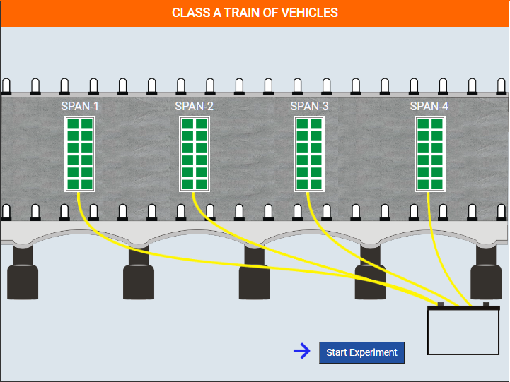

### These steps will be followed for the experiment
**Procedure**
This simulation experiment covers three setups: Class A train of vehicles, Class B train of vehicles and
Class AA (tracked and wheeled) train of vehicles (Class 70 R). Abridge is considered on which 4 sets of
PZT patches are embedded. Each set contains 12 PZT patches. So overall, the bridge contains 48 sensors. 
The bridge has four spans. Initially in energy harvesting stage/idle state, each set of sensors are connected to the battery through wires.  The user can change choose the vehicle class (A or B or AA) to pass over the bridge. As the truck moves, the mechanical vibrations in the bridge result in generation of voltage across PZT patch.  The generated energy is stored inside a battery. In SHM state, SHM device (AD5933) is attached to the damaged span and the fully charged battery. The energy stored inside the battery is used for SHM of each damaged span.
  

  

  
Figure 2 (a) Energy harvesting stage for Class A train of vehicles (b) SHM of damaged span 1 (c) SHM of
damaged span 2 (d) SHM of damaged span 3  
By clicking the appropriate links, the user can download the signatures corresponding to the baseline
(undamaged) and damaged states. To statistically quantify damage, compute root mean square deviation
(RMSD) in conductance by following equation directly in MS excel:
  

  
Where  
 G0i = Baseline conductance value at ith frequency. 
 G1i = Conductance value after damage at ith frequency. 
n = No. of frequency data points
As an exercise plot a histogram of RMSD for the various damaged states. 
Note your observations and draw conclusions.
