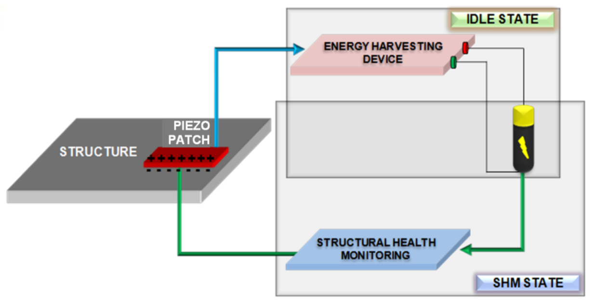

### Theory

This simulation experiment is based on the basic analytical model and experimental study involving surface
bonded Piezoelectric PZT patches operating in the d31-mode for energy harvesting covered in the doctoral thesis of Dr.
Naveet Kaur (for more details <a href="images/naveet.pdf">click here</a>). The d31-mode is explored for the possibility of energy harvesting from the PZT patch owing to its well established suitability for SHM, by
means of either the global vibration technique (Exp. 1) or the local EMI technique (Exp. 3 & 7). The principle of integrated SHM and
energy harvesting is studied using simulation.  
The structure is assumed to be operating in two states, idle state and SHM state. During the idle state (when
SHM is not being performed), the PZT patches will harvest the energy and store it in an appropriate storage
SHM state, such as a battery or a capacitor. In the SHM state, the same stored energy will be utilized for the
SHM of the host structure by the same PZT patch, either in the global mode (standard vibration techniques)
or the local mode (EMI technique) or both. It is assumed that the total duration of the SHM state will be
very small as compared to the idle state. In this experiment, the voltage and the power generated by a PZT
patch surface bonded in the d31-mode on a bridge beam are measured.   

 
 
  
